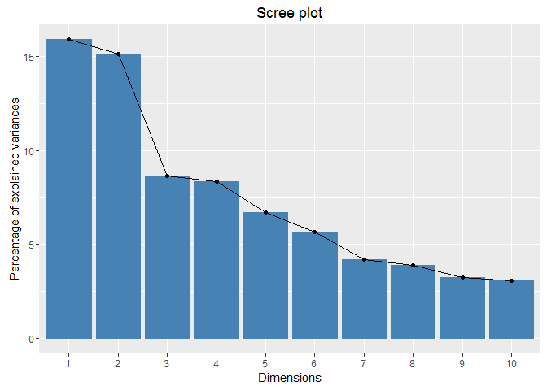
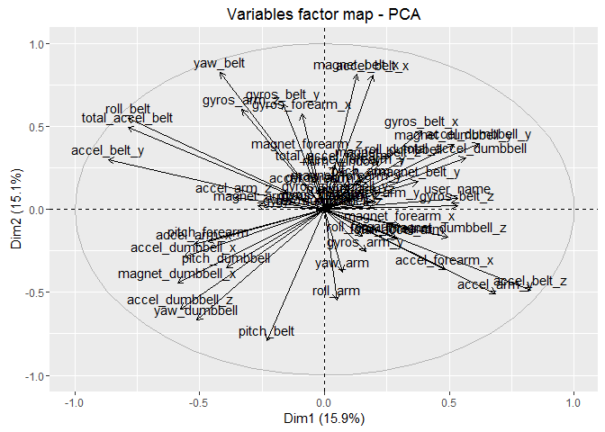

# AccuracyOFmovement
CF Hainey  
August 24, 2016  
#Introduction
Technology and sports are merging together in complex and insightful ways.  You're every movement, pulse, calorie burn, stress level, quality and quantity of your sleep can be monitored with a watch.  The Apple watch is also totted to monitor your diabetes.  For all of these aspects, you are given quantity.  Only sleep is there quality data recorded.  I have written a script to analyze the quality of movement on 6 individuals.  These individuals were asked to lift dumbbells in 5 different ways, from proper to sloppy.  My task was to forecast how 20 different measurements were performed.

I built my model by finding the least amount of variables to explain my dataset using PCA analysis with the package FactoMineR and FACToextra. I found user name, num window, roll belt, pitch belt,total accel belt, and yaw belt to describe the dataset the best.  I performed this PCA analysis. 

Next, I used only these six variables identified in the PCA anlysis to run randomForester on a subset of the training data.  With a high accuracy, I applied the randomForest model to the final test set given by the instructor.  With the test set, the out of sample error was around 1%. I choose this method for it high accuracy and ease of use with RandomForest and caret packages.


#Background
Data came from http://groupware.les.inf.puc-rio.br/har., and the instruction for goal came from the Coursera's Practical Machine Learning course websit https://www.coursera.org/learn/practical-machine-learning/supplement/PvInj/course-project-instructions-read-first.  More Background informatino can be found at http://groupware.les.inf.puc-rio.br/har.


```r
knitr::opts_chunk$set(echo = TRUE)
```


```r
#load data
library(data.table) # allows you to brind in specific columns
dat <- fread("./training1.csv", select = c('user_name','num_window','roll_belt','pitch_belt','yaw_belt','total_accel_belt', 'gyros_belt_x', 'gyros_belt_y', 'gyros_belt_z','accel_belt_x','accel_belt_y','accel_belt_z', 'magnet_belt_x', 'magnet_belt_y', 'magnet_belt_z', 'roll_arm', 'pitch_arm', 'yaw_arm','total_accel_arm', 'gyros_arm_x', 'gyros_arm_y','gyros_arm_z', 'accel_arm_x','accel_arm_y', 'accel_arm_z','magnet_arm_x', 'magnet_arm_y', 'magnet_arm_z', 'roll_dumbbell', 'pitch_dumbbell', 'yaw_dumbbell','total_accel_dumbbell', 'gyros_dumbbell_x',  'gyros_dumbbell_y',  'gyros_dumbbell_z', 'accel_dumbbell_x','accel_dumbbell_y', 'accel_dumbbell_z', 'magnet_dumbbell_x', 'magnet_dumbbell_y', 'magnet_dumbbell_z', 'roll_forearm', 'pitch_forearm', 'yaw_forearm', 'total_accel_forearm', 'gyros_forearm_x', 'gyros_forearm_y', 'gyros_forearm_z', 'accel_forearm_x',  'accel_forearm_y', 'accel_forearm_z','magnet_forearm_x', 'magnet_forearm_y','magnet_forearm_z','classe'))

#change names to dummy variables
dat$user_name[dat$user_name == 'carlitos'] <- 1
dat$user_name[dat$user_name == 'pedro'] <- 2
dat$user_name[dat$user_name == 'adelmo'] <- 3
dat$user_name[dat$user_name == 'charles'] <- 4
dat$user_name[dat$user_name == 'eurico'] <- 5
dat$user_name[dat$user_name == 'jeremy'] <- 6
dat$user_name <-as.numeric(dat$user_name)

set.seed(1234)
#subset data for validation
library(ggplot2); library(caret);
# Create a building data set and validation set
inBuild <- createDataPartition(y=dat$classe, p=0.7, list=FALSE)
validation <- dat[-inBuild,]; buildData <- dat[inBuild,]
inTrain <- createDataPartition(y=buildData$classe, p=0.7, list=FALSE)
training <- buildData[inTrain,]; testing <- buildData[-inTrain,]
train1 <- training

# set up PCA
library("factoextra")
library("FactoMineR")
train1 <- training
pca_set<-train1[,classe:=NULL]
res.pca <- PCA(pca_set, graph = FALSE)
#print(res.pca)
eigenvalues <- res.pca$eig
head(eigenvalues[, 1:2])
```

```
##        eigenvalue percentage of variance
## comp 1   8.579474              15.887914
## comp 2   8.155645              15.103047
## comp 3   4.656151               8.622503
## comp 4   4.496261               8.326408
## comp 5   3.626673               6.716060
## comp 6   3.057514               5.662063
```

```r
fviz_screeplot(res.pca, ncp=10)
```

<!-- -->

```r
# Coordinates of variables
head(res.pca$var$coord)
```

```
##                        Dim.1       Dim.2       Dim.3       Dim.4
## user_name         0.53408781  0.06875271  0.08539430 -0.06690905
## num_window        0.07031285  0.23607366  0.09001155 -0.02272162
## roll_belt        -0.78752675  0.54895266 -0.10859777  0.11405512
## pitch_belt       -0.23254460 -0.79154850 -0.10144911  0.11535534
## yaw_belt         -0.41949461  0.82363686 -0.03651631  0.02695760
## total_accel_belt -0.78742947  0.49295249 -0.14367282  0.13610460
##                        Dim.5
## user_name         0.07272889
## num_window       -0.03044451
## roll_belt         0.03021953
## pitch_belt       -0.18068859
## yaw_belt          0.10434425
## total_accel_belt -0.01044061
```

```r
fviz_pca_var(res.pca)
```

<!-- -->

```r
#load only values found in pca analysis in.
library(data.table) # allows you to brind in specific columns
dat <- fread("./training1.csv", select = c( "user_name", "num_window", "roll_belt", "pitch_belt", "yaw_belt", "total_accel_belt", "classe" ))
test2 <- fread("./testing1.csv", select = c( "user_name", "num_window", "roll_belt", "pitch_belt", "yaw_belt", "total_accel_belt", "classe"))

#change names to dummy variables and give columns proper class
dat$user_name[dat$user_name == 'carlitos'] <- 1
dat$user_name[dat$user_name == 'pedro'] <- 2
dat$user_name[dat$user_name == 'adelmo'] <- 3
dat$user_name[dat$user_name == 'charles'] <- 4
dat$user_name[dat$user_name == 'eurico'] <- 5
dat$user_name[dat$user_name == 'jeremy'] <- 6
test2$user_name[test2$user_name == 'carlitos'] <- 1
test2$user_name[test2$user_name == 'pedro'] <- 2
test2$user_name[test2$user_name == 'adelmo'] <- 3
test2$user_name[test2$user_name == 'charles'] <- 4
test2$user_name[test2$user_name == 'eurico'] <- 5
test2$user_name[test2$user_name == 'jeremy'] <- 6
test2$num_window <-as.numeric(test2$num_window)
test2$total_accel_belt <-as.numeric(test2$total_accel_belt)
test2$user_name <-as.factor(test2$user_name)
set.seed(1234)
#run modeling and prediction
library(ggplot2); library(caret);
# Create a building data set and validation set
inBuild <- createDataPartition(y=dat$classe,p=0.7, list=FALSE)
validation <- dat[-inBuild,]; buildData <- dat[inBuild,]
inTrain <- createDataPartition(y=buildData$classe,p=0.7, list=FALSE)
training <- buildData[inTrain,]; testing <- buildData[-inTrain,]
train1 <- training
training$num_window <-as.numeric(training$num_window)
training$total_accel_belt <-as.numeric(training$total_accel_belt)
training$user_name <-as.factor(training$user_name)
testing$num_window <-as.numeric(testing$num_window)
testing$total_accel_belt <-as.numeric(testing$total_accel_belt)
testing$user_name <-as.factor(testing$user_name)
set.seed(1234)
library(randomForest)
modrf = randomForest(factor(classe) ~ ., data=training, na.action=na.roughfix,importance=TRUE)
modrf
```

```
## 
## Call:
##  randomForest(formula = factor(classe) ~ ., data = training, importance = TRUE,      na.action = na.roughfix) 
##                Type of random forest: classification
##                      Number of trees: 500
## No. of variables tried at each split: 2
## 
##         OOB estimate of  error rate: 0.23%
## Confusion matrix:
##      A    B    C    D    E  class.error
## A 2734    0    0    0    1 0.0003656307
## B    2 1857    2    0    0 0.0021493821
## C    0    1 1675    2    0 0.0017878427
## D    0    0    3 1573    1 0.0025364616
## E    1    2    2    5 1758 0.0056561086
```

```r
#predict with test and testing2 set
importance(modrf, type = 2)
```

```
##                  MeanDecreaseGini
## user_name                412.4914
## num_window              3140.3638
## roll_belt               1257.2533
## pitch_belt              1071.3851
## yaw_belt                1216.4549
## total_accel_belt         409.6965
```

```r
forest.pred <- predict(modrf, testing)
forest.per <- table(testing$classe, forest.pred, dnn=c("Actual", "Predicted"))
forest.per
```

```
##       Predicted
## Actual    A    B    C    D    E
##      A 1171    0    0    0    0
##      B    1  792    2    2    0
##      C    0    0  718    0    0
##      D    0    0    0  675    0
##      E    0    0    0    3  754
```

```r
forest_val <-predict(modrf, test2)
forest_val
```

```
##  1  2  3  4  5  6  7  8  9 10 11 12 13 14 15 16 17 18 19 20 
##  B  A  B  A  A  E  D  B  A  A  B  C  B  A  E  E  A  B  B  B 
## Levels: A B C D E
```

#Resources
http://www.sthda.com/english/wiki/factominer-and-factoextra-principal-component-analysis-visualization-r-software-and-data-mining
